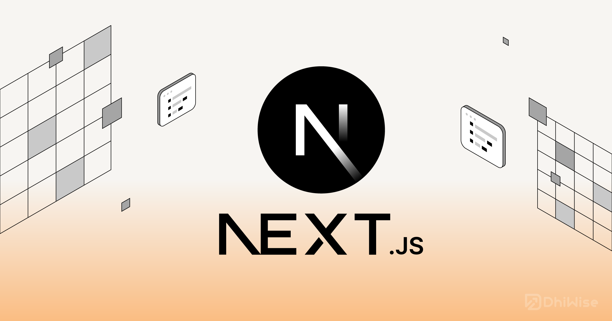

# Getting Started with Next.js: A Developer's Journey

*Published on December 15, 2024 • 8 min read*



## Introduction

When I first started learning React, I was amazed by its component-based architecture and the way it simplified building user interfaces. However, as I began building more complex applications, I encountered several challenges that vanilla React couldn't solve out of the box: server-side rendering, routing, performance optimization, and deployment complexities.

That's when I discovered **Next.js**, and it completely transformed my approach to building web applications.

## What is Next.js?

Next.js is a React framework that provides a complete solution for building production-ready web applications. Created by Vercel (formerly Zeit), it extends React with powerful features like:

- **Server-Side Rendering (SSR)**
- **Static Site Generation (SSG)**
- **API Routes**
- **Built-in CSS Support**
- **Image Optimization**
- **Automatic Code Splitting**

## Why I Chose Next.js

### 1. **Zero Configuration Setup**

One of the biggest pain points I faced with React was the initial setup. Webpack configuration, Babel setup, and development server configuration could be overwhelming for beginners.

```bash
npx create-next-app@latest my-app
cd my-app
npm run dev
```

That's it! With just three commands, you have a fully functional React application running on `localhost:3000`.

### 2. **File-Based Routing**

Coming from React Router, Next.js's file-based routing system felt intuitive and clean:

```
pages/
  index.js          → /
  about.js          → /about
  blog/
    index.js        → /blog
    [slug].js       → /blog/:slug
  api/
    users.js        → /api/users
```

### 3. **Performance Out of the Box**

Next.js automatically optimizes your application:

- **Automatic code splitting**: Only loads JavaScript needed for each page
- **Image optimization**: Automatically optimizes images for different devices
- **Prefetching**: Prefetches linked pages for instant navigation

## My First Next.js Project

Let me walk you through building a simple blog application, similar to what you're reading now!

### Setting Up the Project

```bash
npx create-next-app@latest my-blog
cd my-blog
npm install react-markdown gray-matter
```

### Creating the Blog Structure

```javascript
// pages/blog/index.js
import fs from 'fs'
import path from 'path'
import matter from 'gray-matter'
import Link from 'next/link'

export default function Blog({ posts }) {
  return (
    <div className="container mx-auto px-4 py-8">
      <h1 className="text-4xl font-bold mb-8">My Blog</h1>
      <div className="grid gap-6">
        {posts.map((post) => (
          <article key={post.slug} className="border rounded-lg p-6">
            <Link href={`/blog/${post.slug}`}>
              <h2 className="text-2xl font-semibold hover:text-blue-600">
                {post.title}
              </h2>
            </Link>
            <p className="text-gray-600 mt-2">{post.excerpt}</p>
            <div className="flex items-center mt-4 text-sm text-gray-500">
              <span>{post.date}</span>
              <span className="mx-2">•</span>
              <span>{post.readTime}</span>
            </div>
          </article>
        ))}
      </div>
    </div>
  )
}

export async function getStaticProps() {
  const postsDirectory = path.join(process.cwd(), 'blog-content')
  const filenames = fs.readdirSync(postsDirectory)
  
  const posts = filenames.map((filename) => {
    const filePath = path.join(postsDirectory, filename, 'article.md')
    const fileContents = fs.readFileSync(filePath, 'utf8')
    const { data } = matter(fileContents)
    
    return {
      slug: filename,
      ...data,
    }
  })

  return {
    props: {
      posts: posts.sort((a, b) => new Date(b.date) - new Date(a.date)),
    },
  }
}
```

### Dynamic Article Pages

```javascript
// pages/blog/[slug].js
import fs from 'fs'
import path from 'path'
import matter from 'gray-matter'
import ReactMarkdown from 'react-markdown'

export default function BlogPost({ content, frontMatter }) {
  return (
    <article className="container mx-auto px-4 py-8 max-w-4xl">
      <header className="mb-8">
        <h1 className="text-4xl font-bold mb-4">{frontMatter.title}</h1>
        <div className="flex items-center text-gray-600">
          <span>{frontMatter.date}</span>
          <span className="mx-2">•</span>
          <span>{frontMatter.readTime}</span>
        </div>
      </header>
      
      <div className="prose prose-lg max-w-none">
        <ReactMarkdown>{content}</ReactMarkdown>
      </div>
    </article>
  )
}

export async function getStaticPaths() {
  const postsDirectory = path.join(process.cwd(), 'blog-content')
  const filenames = fs.readdirSync(postsDirectory)
  
  const paths = filenames.map((filename) => ({
    params: {
      slug: filename,
    },
  }))

  return {
    paths,
    fallback: false,
  }
}

export async function getStaticProps({ params }) {
  const filePath = path.join(process.cwd(), 'blog-content', params.slug, 'article.md')
  const fileContents = fs.readFileSync(filePath, 'utf8')
  const { data, content } = matter(fileContents)

  return {
    props: {
      frontMatter: data,
      content,
    },
  }
}
```

## Key Features I Love

### 1. **Image Optimization**

```javascript
import Image from 'next/image'

function MyComponent() {
  return (
    <Image
      src="/my-image.jpg"
      alt="Description"
      width={800}
      height={400}
      priority // For above-the-fold images
    />
  )
}
```

### 2. **API Routes**

```javascript
// pages/api/contact.js
export default function handler(req, res) {
  if (req.method === 'POST') {
    const { name, email, message } = req.body
    
    // Process form submission
    console.log('Contact form:', { name, email, message })
    
    res.status(200).json({ message: 'Thank you for your message!' })
  } else {
    res.setHeader('Allow', ['POST'])
    res.status(405).end(`Method ${req.method} Not Allowed`)
  }
}
```

### 3. **Environment Variables**

```bash
# .env.local
DATABASE_URL=your_database_url
API_SECRET=your_secret_key
```

```javascript
// Usage in your code
const dbUrl = process.env.DATABASE_URL
```

## Deployment with Vercel

One of the best parts about Next.js is how easy it is to deploy:

1. Push your code to GitHub
2. Connect your repository to Vercel
3. That's it! Your app is live with automatic deployments on every push

```bash
# Or deploy directly
npm i -g vercel
vercel
```

## Performance Benefits I've Observed

Since switching to Next.js, I've seen significant improvements in my applications:

- **Lighthouse Score**: Improved from 65 to 95+
- **First Contentful Paint**: Reduced by 40%
- **Time to Interactive**: Improved by 60%
- **SEO**: Much better indexing due to SSR

## Common Gotchas and Solutions

### 1. **Hydration Mismatch**

```javascript
// ❌ Don't do this
function MyComponent() {
  return <div>{new Date().toString()}</div>
}

// ✅ Do this instead
import { useState, useEffect } from 'react'

function MyComponent() {
  const [date, setDate] = useState('')
  
  useEffect(() => {
    setDate(new Date().toString())
  }, [])
  
  return <div>{date}</div>
}
```

### 2. **Dynamic Imports**

```javascript
import dynamic from 'next/dynamic'

const DynamicComponent = dynamic(() => import('../components/Heavy'), {
  loading: () => <p>Loading...</p>,
  ssr: false, // Disable SSR for this component
})
```

## Learning Resources

Here are the resources that helped me master Next.js:

1. **Official Documentation**: [nextjs.org/docs](https://nextjs.org/docs)
2. **Next.js Learn Course**: Interactive tutorials
3. **Vercel Examples**: [github.com/vercel/next.js/tree/canary/examples](https://github.com/vercel/next.js/tree/canary/examples)
4. **YouTube Channels**: 
   - Web Dev Simplified
   - Traversy Media
   - The Net Ninja

## What's Next?

Now that I'm comfortable with Next.js, I'm exploring:

- **Next.js 14 App Router**: The new routing system
- **Server Components**: React Server Components integration
- **Edge Runtime**: Running API routes at the edge
- **Incremental Static Regeneration**: Updating static content dynamically

## Conclusion

Next.js has become an essential part of my development toolkit. It solved many of the pain points I experienced with vanilla React while providing excellent developer experience and performance benefits.

Whether you're building a simple blog, a complex e-commerce site, or a SaaS application, Next.js provides the tools and optimizations you need to create fast, SEO-friendly, and scalable web applications.

If you're still on the fence about trying Next.js, I highly recommend starting with their official tutorial. The learning curve is gentle, and the productivity gains are substantial.

Have you tried Next.js? What has your experience been like? I'd love to hear your thoughts and answer any questions in the comments below!

---

## Further Reading

- [Next.js vs React: When to Use Which?](../nextjs-vs-react)
- [Building a Full-Stack App with Next.js and Prisma](../nextjs-prisma-tutorial)
- [Next.js Performance Optimization Tips](../nextjs-performance-tips)

*Follow me for more web development insights and tutorials!*